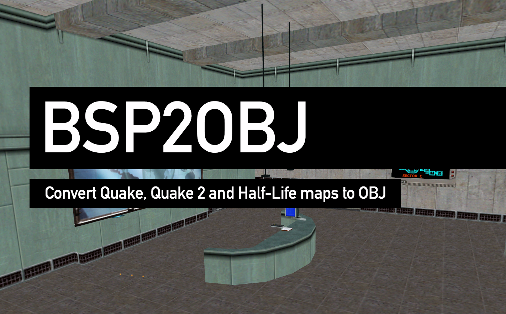

BSP2OBJ is a Python module and command-line utility that is capable of converting BSP map files into OBJ/MTL files (with accompanying PNG textures). It comes with support for Quake, Quake 2 and Half-Life maps.

## Installation

The easiest way to install BSP2OBJ is to simply use `pip` like so:

```
pip install bsp2obj
```

The installation process should create an easily accessible `bsp2obj` command-line utility.

## Using the command-line utility

### Exporting Quake/Quake 2 maps:
Both Quake and Quake 2 store map and other associated metadata within PAK files. As such, you'll need to let BSP2OBJ know the target PAK file with the `-p` argument. Additionally, you'll also need to pass along the path of the colour palette within the PAK file to ensure texture data is decoded correctly. This can be done using the `-c` argument.

Here's how to extract the starting level of Quake 1:
```
bsp2obj -o q1_start -p Q1.PAK -m maps/start.bsp -c gfx/palette.lmp
```

And heres how you'd extra the first demo level from Quake 2:
```
bsp2obj -o q2_demo1 -p Q2.PAK -m maps/demo1.bsp -c pics/colormap.pcx
```

### Exporting a Half-Life map:
Half-Life differed slightly from Quake and Quake 2 by ditching the use of PAK files and opting to instead store textures and other metadata in the file system. As a result, you can omit the `-p` argument in this case, and instead pass absolute paths to the required `.bsp` and `.lmp` palette files.

Here's how I went about extracting the first level of Half-Life from my Steam library on macOS:
```
bsp2obj -o hl_c1a0 -m /Users/measuredweighed/Library/Application\ Support/Steam/steamapps/common/Half-Life/valve/maps/c1a0.bsp -c /Users/measuredweighed/Library/Application\ Support/Steam/steamapps/common/Half-Life/valve/gfx/palette.lmp
```

### Dumping PAK contents
You may provide the optional argument `-d` to dump a list of any filenames contained within a PAK file that match a given regular expression. As an example, one could dump all of the `.bsp` files in a PAK file like so:
```
bsp2obj -p Q2.PAK -d ".bsp"
```

Alternatively, if you provide a pattern of `*` every file will be returned:
```
bsp2obj -p Q2.PAK -d "*"
```

## Future work
There are a number of things I'd like to improve when it comes to BSP2OBJ. Below I've compiled a list of future to-dos. Pull requests are very much welcome, even if they don't concern items on this list:

* Add support for entity and mesh parsing
* Add additional arguments and flags to make navigating and exploring the contents of PAK/BSP files easier
* Make the generated OBJ files more efficient. Currently there's a great deal of duplication in terms of vertex normals that could be indexed to save space.
* Better support for skybox textures, which are treated as special cases in both Quake and Quake 2 (and likely Half-Life)

It should also be noted that I am by no means an expert when it comes to Python, so please feel free to call me out if I'm doing anything silly... 